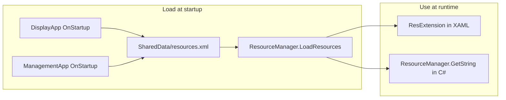

# How [SharedData/resources.xml](SharedData/resources.xml) Is Used

## Purpose

`resources.xml` is the **localization/UI strings file** for the Employee Shift Management System. It holds key-value pairs (`<string key="...">value</string>`) used for tab headers, labels, buttons, messages, and other UI text so that wording can be changed in one place (and potentially localized later).

## 1. File format and content

- Root element: `<resources>`.
- Each entry: `<string key="key_name">Display text</string>`.
- Keys are used across [Shared/Utils/ResourceManager.cs](Shared/Utils/ResourceManager.cs), XAML, and code-behind (e.g. `app_title`, `tab_employee_management`, `label_name`, `msg_error`, `display_supervisor`).

## 2. Loading at startup

Both WPF apps load the file during startup:

- **[DisplayApp/App.xaml.cs](DisplayApp/App.xaml.cs)** (lines 46–81): `LoadLocalizedResources()` resolves the path to `SharedData/resources.xml` (relative to app base directory: `..\..\..\SharedData\resources.xml`, then one more `..` if not found, then a hardcoded fallback `E:\projects\employee_management_csharp\SharedData\resources.xml`). If the file exists, it calls `ResourceManager.LoadResources(sharedDataPath)`.
- **[ManagementApp/App.xaml.cs](ManagementApp/App.xaml.cs)** (lines 106–139): Same logic for the Management app.

So **both DisplayApp and ManagementApp** load the **same** `resources.xml` from the SharedData folder. The file is not copied by the build; the apps rely on that path resolution at runtime.

## 3. Storage and API: ResourceManager

**[Shared/Utils/ResourceManager.cs](Shared/Utils/ResourceManager.cs)** (in the Shared project):

- **LoadResources(string filePath)**: Reads the XML, expects root name `"resources"`, iterates over `<string>` elements, and fills an in-memory `Dictionary<string, string>` (key → value). Thread-safe (lock). If the file is missing or invalid, it does not throw; it logs and sets `_isLoaded = false`.
- **GetString(key, fallback)**: Returns the string for `key`, or `fallback`, or `"[key]"` if key is missing.
- **GetFormattedString(key, args)**: Returns `string.Format(GetString(key), args)` (used for parameterized messages); defined but not currently used in the codebase.
- **IsLoaded**, **StringCount**, **HasKey(key)**, **Reload(filePath)** are also available.

So **all usage of resources.xml goes through this static ResourceManager** after it has been loaded.

## 4. Where the loaded strings are used

### XAML (markup extensions)

- **ManagementApp**: Uses `ResExtension` from [ManagementApp/Converters/ResourceExtension.cs](ManagementApp/Converters/ResourceExtension.cs) (class is named `ResExtension`). XAML declares `xmlns:converters="clr-namespace:ManagementApp.Converters"` and binds with `{converters:Res app_title}`, `{converters:Res tab_employee_management}`, `{converters:Res header_employee_list}`, etc. in [ManagementApp/Views/MainWindow.xaml](ManagementApp/Views/MainWindow.xaml) and elsewhere.
- **DisplayApp**: Uses `ResExtension` from [DisplayApp/Converters/ResExtension.cs](DisplayApp/Converters/ResExtension.cs). Same idea: a markup extension that calls `ResourceManager.GetString(Key, Fallback)` in `ProvideValue`. DisplayApp XAML uses the same pattern with its own `converters` namespace.

So in XAML, **resources.xml is used only indirectly**: the markup extension reads from the already-loaded ResourceManager (which was filled from `resources.xml` at startup).

### Code-behind (C#)

- **DisplayApp**: [DisplayApp/App.xaml.cs](DisplayApp/App.xaml.cs) uses `ResourceManager.GetString("msg_error", "Error")` for message boxes. [DisplayApp/MainWindow.xaml.cs](DisplayApp/MainWindow.xaml.cs) uses keys such as `display_last_update`, `display_supervisor`, `display_no_supervisor`, `shift_morning`, `shift_afternoon`, `shift_night`, `display_foreman` for labels and status text.
- **ManagementApp**: [ManagementApp/Views/MainWindow.xaml.cs](ManagementApp/Views/MainWindow.xaml.cs) uses many keys for messages and status: `msg_error`, `msg_warning`, `msg_data_loaded`, `msg_employee_added`, `msg_select_employee`, `msg_confirm_delete_employee`, `header_confirm_delete`, `msg_select_csv`, `msg_import_result`, etc.

All of these resolve to strings that were loaded from `resources.xml` via `ResourceManager.LoadResources`.

## 5. Tests

- **[SharedTests/ResourceManagerTests.cs](SharedTests/ResourceManagerTests.cs)** locates `SharedData/resources.xml` from several possible base paths (including an absolute path), loads it with `ResourceManager.LoadResources`, then checks `ResourceManager.GetString("display_supervisor", "")` and `ResourceManager.GetString("display_no_supervisor", "")` to ensure those keys exist and have expected content.

## 6. Data flow (summary)

## 7. Notable details

- **Single shared file**: Both apps read the same `SharedData/resources.xml`; there is no per-app resources file.
- **Path resolution**: No copy to output in .csproj; apps assume the file lives in a `SharedData` folder relative to the executable (or use the hardcoded dev path). Deployments must place `SharedData/resources.xml` accordingly.
- **No live reload in UI**: `Reload(filePath)` exists but is not wired to any UI or file watcher; changing the XML requires restart (or an explicit reload call elsewhere).
- **GetFormattedString**: Present in ResourceManager but unused; code-behind uses `string.Format(ResourceManager.GetString(...), ...)` instead.

This completes the investigation of how `SharedData/resources.xml` is used in the solution.